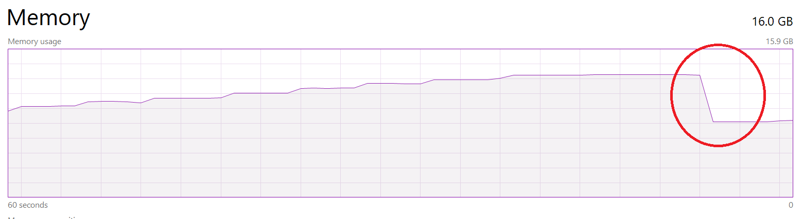

# LoadTestWebApp
Web Application to Simulate Load Test

## Application Setup
1.  Checkout the code.
    ```
    $ git clone https://github.com/parshuram-patil/LoadTestWebApp.git
    ```
2.  Create a python virtual environment
    ```
    $ cd LoadTestWebApp
    $ python -m venv ENV
    ```
3.  Activate the virtual environment

    For Windows:
    ```
    $ cd LoadTestWebApp          (if not already in the project base directory)
    $ .\ENV\Scripts\activate.bat
    ```

    For Bash:
    ```
    $ cd LoadTestWebApp          (if not already in the project base directory)
    $ source ENV/Scripts/activate
    ```
 4.  Download & install required Python Dependencies.
    ```
    (ENV) $ pip install -r requirements.txt
    ```
 5.  Running the Application
 
     ```
     (ENV) $ python app.py
     ```
    
## Memory Test
 
 Memory Test API's will consume either specified/default memory. 
 
### How it works?
  - It divides allowed memory in 10 chunks
  - Consumes all chunks one after another with delay of 5 seconds
  - After consuming all the chunks it waits for 10 seconds
  - Finally it releases all the memory and respond back with "Done!"
 
 
### API's
 
- Consuming memory of default size i.e 1GB
    ```
    curl http://127.0.0.1:5000/load/test/memory
    ```

- Consuming memory of custom size
   
   URL parameter 'allowedMemory' specifies how much memory in Gb you want to consume
   
   Eg.
    - Consuming 10 GB
        ```
        curl http://127.0.0.1:5000/load/test/memory?allowedMemory=10
        ```
    - Consuming 5 GB
        ```
        curl http://127.0.0.1:5000/load/test/memory?allowedMemory=4
        ```

- Server logs of API consuming 5GB Memory

    
    
    

